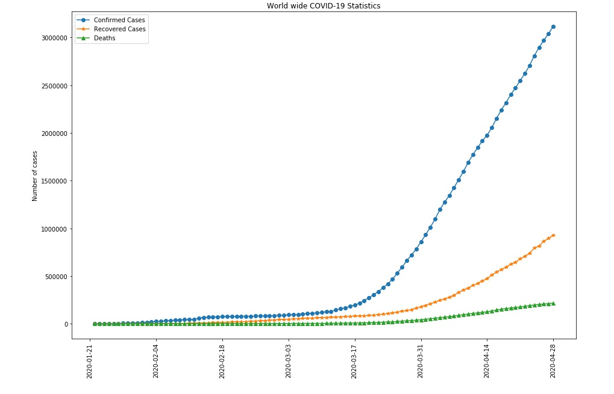
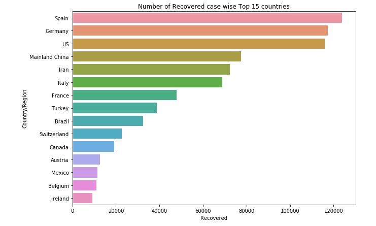
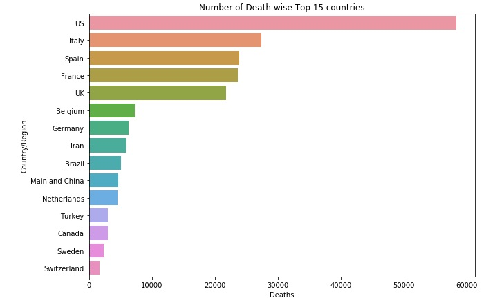
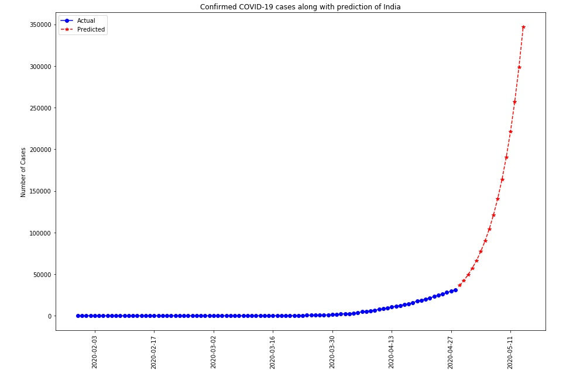

# Analysis of COVID-19 data

In this Repository we will analyze the growth and statistics of COVID-19 pandemic spread. I have collected the data from [Kaggle dataset](https://www.kaggle.com/sudalairajkumar/novel-corona-virus-2019-dataset#covid_19_data.csv). This data provides the daily information on the number of COVID affected cases through the world.

I have used the file `covid_19_data.csv` file for the analysis. The file contains COVID-19 statistics throughout whole world till `2020-04-28`.
The file columns are:

| Column          | Description                          |
|:----------------|:-------------------------------------|
| SNo             | Serial Number                        |
| ObservationDate | Observation date in `mm/dd/yyyy`     |
| Province/State  | Province or State                    |
| Country/Region  | Country or region                    |
| Last Update     | Last update date time in UTC         |
| Confirmed       | Cumulative number of confirmed cases |
| Deaths          | Cumulative number of deaths cases    |
| Recovered       | Cumulative number of recovered cases |

**World wide update (04/28/2020) As per the data**
- Total Confirmed Cases: 3116398.0
- Total Recovered Cases: 928658.0
- Total Deaths:  217153.0
- Total Active Cases: 1970587.0
- Total Countries/Regions effected with COVID: 220
- Percentage of Recovered cases: 29.799082145476927
- Percentage of deaths: 6.968076606389813

The following images shows the day wise Confirmed, Recovered and Deaths statistics of COVID-19 throughout the world.

The following visualizations shows the Top 15 countries Recovered and Deaths Comparisions.
 

Also we predicted the Confirmed cases for next 15 days using the `Average Growth Factor`.

**This is a very basic analysis. We can use much for effective methods to predict the cases.**